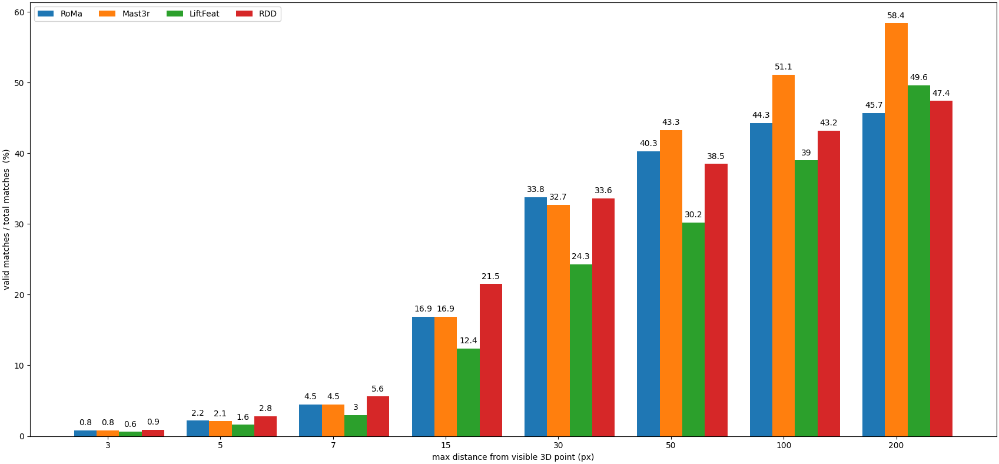

# Computer vision exam project 
A.Y. 2024/25

> Authors: Enrico Bonoldi - Francesco Mantoan

Tested feature-matching NN:
- [RDD](https://github.com/xtcpete/rdd) 
- [LiftFeat](https://github.com/lyp-deeplearning/LiftFeat)
- [Mast3r](https://github.com/naver/mast3r)
- [RoMa](https://github.com/Vincentqyw/RoMa)

## Reference and target images

We selected two images(reference and target respectively)s


|  |  |
| :-----------------------: | :--------------------------: |
|      Reference image      |         Target image         |
|                           |                              |


We ran each neural network on this pair obtaining matches on the images pair.

| Model    | Total matches |
| -------- | ------------- |
| RoMa     | 10000         |
| Mast3r   | 1445          |
| LiftFeat | 28523         |
| RDD      | 1837          |




## Setup

> To run torch on CPU run ```export CUDA_VISIBLE_DEVICES=""```

Clone this report: ```git clone --recurse-submodules [this repo]```
Apply patches: ```patch -p1 < patches/*.diff```
Run setup (may take a while...): ````python3 setupEnv.py```


## References

- [Image matching webUI](https://github.com/Vincentqyw/image-matching-webui)